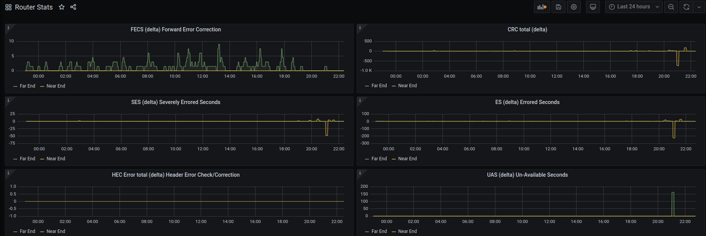

# Why

I had a lot of line trouble lately.  I knew the router provided the stats but it doesn't do anything with them. I wanted to visually check the line stats and be able to look as the history of the line.
Prometheus and Grafana seemed the best idea as i had these already in use watching my docker container stats.
# Summary

A python script to read the detailed DrayTek router stats.  You can think of this as a proxy to the router stats for Prometheus.

The following stats are recorded and presented as Open Metrics (Prometheus) stats (those that can be used as counters and gauges)
```
> vdsl status more
  ---------------------- ATU-R Info (hw: annex A, f/w: annex A/B/C) -----------
                  Near End        Far End    Note
 Trellis      :      1               1
 Bitswap      :      1               1
 ReTxEnable   :      1               1
 VirtualNoise :      0               0
 20BitSupport :      0               0
 LatencyPath  :      0               0
 LOS          :      0               0
 LOF          :      0               0
 LPR          :      0               0
 LOM          :      0               0
 SosSuccess   :      0               0
 NCD          :      0               0
 LCD          :      0               0
 FECS         :      0            2575 (seconds)
 ES           :     35               3 (seconds)
 SES          :      3               1 (seconds)
 LOSS         :      0               0 (seconds)
 UAS          :     27            1861 (seconds)
 HECError     :      0               0
 CRC          :    126              31
 RsCorrection :      0               0
 INP          :    230             160 (symbols)
 InterleaveDelay :      0              62 (1/100 ms)
 NFEC         :     32              32
 RFEC         :     16              16
 LSYMB        :     16              16
 INTLVBLOCK   :     32              32
 AELEM        :      0            ----
```

# How it works

## Environment Variables

The script requires some environment variables to be loaded, i do this in docker using a .env config file:

```
IP=192.168.0.1
USERNAME=admin
PASSWORD=password
SERVER_PORT=8081
METRICS_PORT=8001
TELNET_CMD=/usr/bin/telnet
SPAWN_TIMEOUT=5
```

## Telnet

The script spawns a telnet connection to the router to gather the stats from the CLI (It could be easily changed to use SSH)
It does this in around 1/2second. Which is plenty fast enough for me.

The remote prometheus call to `/metrics`, fires off the telnet request, so this will poll as fast as you want it to.   I am doing this every 5mins.

## Python Modules

The bulk of the work is done by [Python Expect](https://pexpect.readthedocs.io/en/stable/) (to gather the stats), [Template Text Parser](https://ttp.readthedocs.io/en/latest/) (to parse the stats) and of course the [Prometheus Python Client](https://github.com/prometheus/client_python) (to make them available to Prometheus).

# Prometheus

Set as a target as normal.


```
- job_name: router_stats
  honor_timestamps: true
  scrape_interval: 5m
  scrape_timeout: 10s
  metrics_path: /metrics
  scheme: http
  static_configs:
  - targets:
    - 192.168.0.1:8003
```

# Grafana

A grafana dashboard is included. Import as normal.  It is a work in progress.  You can see in the graph image above the blip we had at around 9pm - this is where we noticed slight buffering on the TV and the router sent an email alert that the line was down.



# Docker and Docker Compose

There is a docker-compose file which creates a docker image (from the included Dockerfile).  This is how i prefer to run my homegrown software.  It runs at around 134MB based on `python3:slim.` You may find it useful.
# Sources

- https://www.draytek.co.uk/support/guides/kb-dsl-status-more

- https://kitz.co.uk/adsl/linestats_errors.htm
